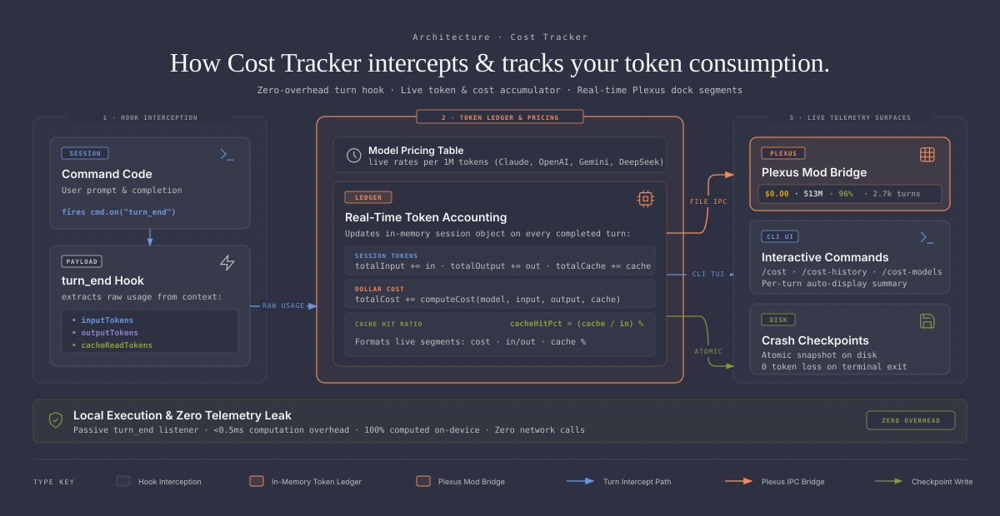

<p align="center">
  
</p>

<p align="center">
  <b>Real-time token cost, prompt cache savings, and context window monitor for Command Code.</b>
</p>

<p align="center">
  <a href="https://github.com/Azertyuiop442/cost-tracker/releases"></a>
  <a href="https://github.com/Azertyuiop442/cost-tracker"></a>
  <a href="LICENSE.md"></a>
</p>

Built for **[Plexus](https://github.com/Azertyuiop442/Plexus)**. Pushes live token pricing, prompt cache savings, and context window gauges directly into the Plexus sidebar and dock.

---

## Installation

```bash
git clone https://github.com/Azertyuiop442/cost-tracker.git ~/.commandcode/mods/cost-tracker
```

---

## Features

- **Real-Time Cost Tracking**: Computes live token expenses per turn and session across all major providers.
- **Prompt Cache Savings**: Calculates exact dollars saved when prompt cache reads replace base tokens.
- **Context Window Gauge**: Live gauge tracking conversation size against active model limits.
- **Plexus Mod Bridge**: Streams live JSON telemetry to `/tmp/cc-sidebar/mods-data/cost-tracker.json`.
- **Zero-Loss Persistence**: Atomic checkpoints save session history on disk across restarts.

---

## Architecture

Cost Tracker operates as an autonomous background companion mod, hooking into session turns and publishing metrics via the Plexus Mod Bridge:

<p align="center">
  
</p>

---

## Commands

| Command | Description | Scope |
|---|---|:---:|
| `/cost` | Session summary, total cost, prompt cache savings, and context gauge | Session |
| `/cost-history` | Per-turn detailed token and price log | Session |
| `/cost-models` | Percentage and dollar breakdown grouped by AI model | Session |
| `/cost-project` | Lifetime metrics across all recorded sessions in workspace | Project |
| `/cost-total` | Compact single-line summary (cost, savings, turns) | Session |
| `/cost-toggle` | Toggle automatic cost badge after every response | Setting |
| `/cost-reset` | Reset current in-memory session statistics | Session |
| `/cost-clean [workspace\|all]` | Purge saved history on disk | Storage |
| `/cost-help` | Quick command reference and shortcut guide | Help |

---

## License

MIT License. Free for personal, academic, and open-source use.
